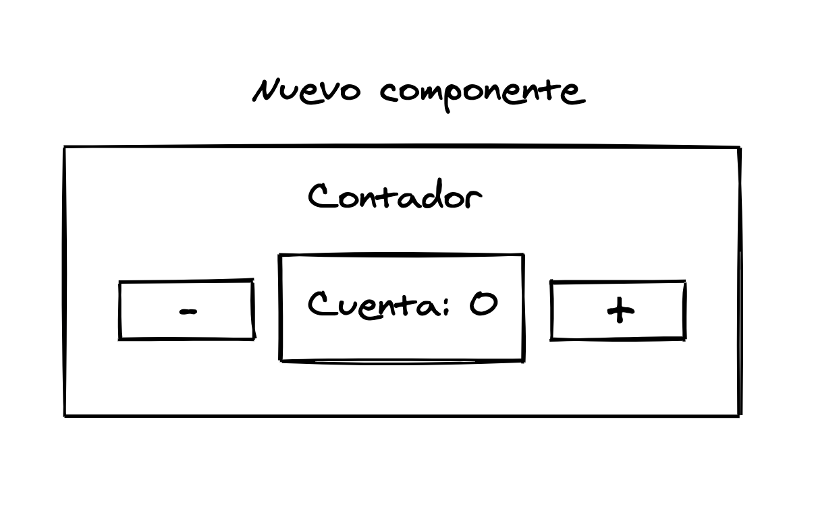
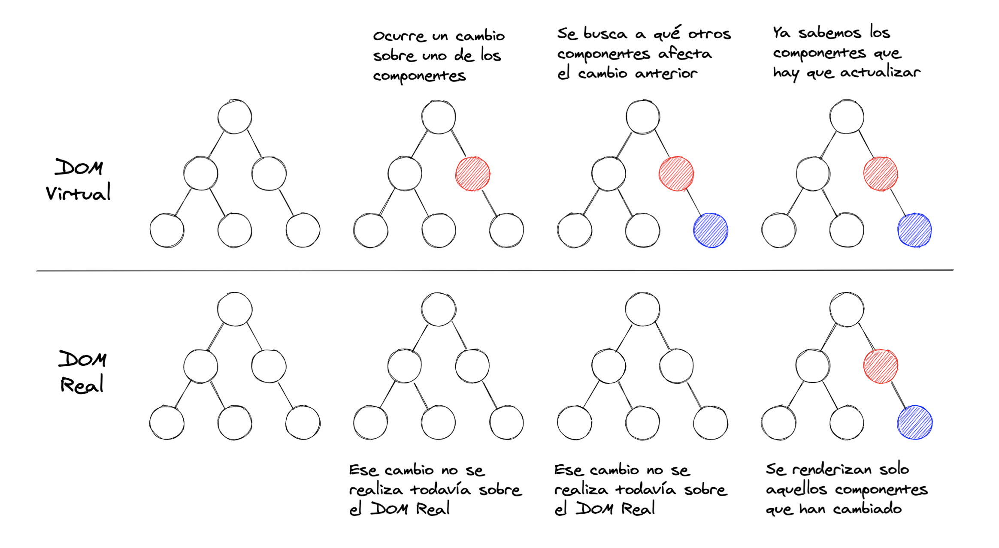

# 1. Introducción a React y ecosistema

[← Índice](README.md) | [← Anterior: Requisitos](00-requisitos.md) | [Siguiente: 2. Entorno →](02-entorno-desarrollo.md)

---

## ¿Qué es React?

React es una librería **open source** para crear **interfaces de usuario** siguiendo la programación orientada a **componentes**. Se centra en la capa de vista: routing, estado global o acceso a APIs se añaden con otras librerías del ecosistema.

No es un framework completo: no impone modelos, plantillas ni estructura de carpetas. Tú eliges Vite, React Router, gestores de estado, etc.

React nació en Facebook para renderizar interfaces muy grandes de forma eficiente. Hoy lo usan Meta, Netflix, Airbnb, Khan Academy y miles de productos más.

## SPA frente a aplicación tradicional

| Multi-página (MPA) | SPA (Single Page Application) |
|--------------------|----------------------------------|
| Cada URL pide HTML nuevo al servidor | Una carga inicial; el cliente actualiza la vista |
| Recarga completa del documento | Cambios parciales en pantalla |
| Menos lógica en el navegador | Mucha lógica en TypeScript |

En una SPA, `index.html` se carga una vez; React (y el router) actualizan el contenido según la ruta y el **estado** de la aplicación.

## Arquitectura por componentes

En React **todo son componentes**: piezas reutilizables que combinan vista, comportamiento y, cuando hace falta, estado local.

- **Composición**: un componente incluye otros (como funciones que llaman a funciones).
- **Reutilización**: el mismo `Boton` en muchas pantallas con distintas props.
- **Encapsulación**: la lógica vive dentro del componente; facilita mantenimiento y pruebas.




## Modelo declarativo

Describes **qué** debe verse; React decide **cómo** actualizar el DOM.

```tsx
// Imperativo: manipulas el DOM a mano
const app = document.getElementById('app');
const h1 = document.createElement('h1');
h1.innerText = 'Hola';
app?.appendChild(h1);

// Declarativo: React
import { createRoot } from 'react-dom/client';

const Hola = () => (
  <div id="contenedor-saludo">
    <h1>Hola mundo</h1>
  </div>
);

createRoot(document.getElementById('root')!).render(<Hola />);
```

En la práctica escribirás solo la versión declarativa (TSX).

## Virtual DOM

React mantiene en memoria una representación del DOM (**Virtual DOM**). Cuando cambia el estado:

1. Actualiza el Virtual DOM.
2. Calcula el **diff** mínimo respecto al DOM real.
3. Aplica solo esos cambios.

Así evitas repintar toda la página en cada pulsación de botón.



No interactúas con la API del DOM directamente: trabajas con elementos React (TSX) y React sincroniza el DOM real de forma eficiente.

## React frente a jQuery

Con **jQuery** enlazas eventos, modificas nodos del DOM y sincronizas datos manualmente.

Con **React** declaras la UI en función del **estado**. Cuando el estado cambia, la vista se actualiza sola.


## Ecosistema habitual en este curso

| Herramienta | Uso |
|-------------|-----|
| **Vite** | Servidor de desarrollo y build de producción |
| **TypeScript** | Tipos en `.ts` y `.tsx` |
| **React Router** | Rutas en la SPA |
| Opcional | Testing Library, Zustand, Redux, librerías UI (MUI, etc.) |

En el [capítulo 2](02-entorno-desarrollo.md) montarás el proyecto con Vite y la plantilla `react-ts`.
